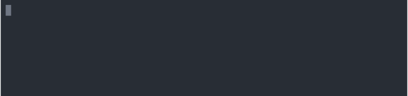
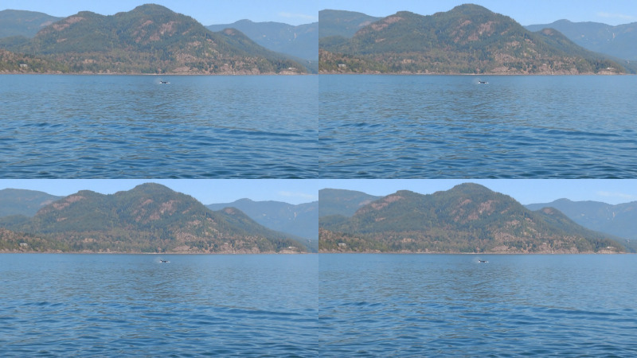
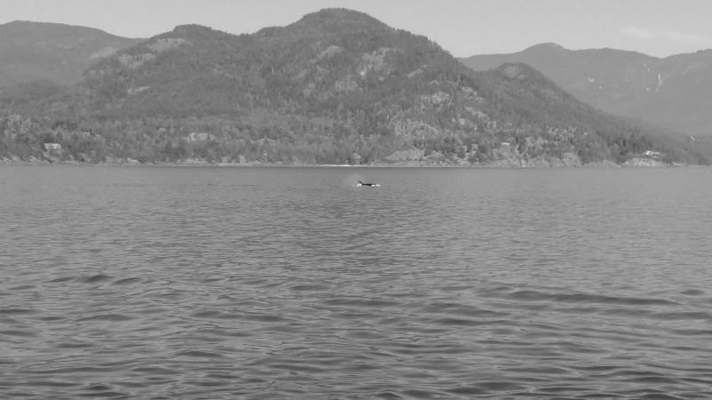

[](https://github.com/colin-nolan/video-frame-fuse/actions)

# Video Frame FUSE
_FUSE mount for accessing frames in a video as images - supports different image types and filters._


## Installation
Prebuilt binaries are available as [part of GitHub Releases](https://github.com/colin-nolan/video-frame-fuse/releases).
```shell
# Example configuration
version=0.1.0
arch=x86_64

# sudo may be required to run these commands
curl -fSL "https://github.com/colin-nolan/video-frame-fuse/releases/download/${version}/video-frame-fuse-${arch}" -o /usr/local/bin/video-frame-fuse
chmod +x /usr/local/bin/video-frame-fuse
```

FUSE is required to run the software (`apt install fuse`; `brew cask install osxfuse`; `yum install fuse`).

For information on how to build a binary for your system, please see the [development section](#development).


## Usage
```text
USAGE:
    video-frame-fuse [FLAGS] [OPTIONS] <video-location> <fuse-mount-location>

FLAGS:
        --foreground    run in foreground (default is to daemonize)
    -h, --help          Prints help information
    -V, --version       Prints version information

OPTIONS:
        --logfile <logfile>    write logs to this location when demonized (not in foreground)

ARGS:
    <video-location>         location of the video file to use
    <fuse-mount-location>    location of directory to mount fuse (will create if does not exist)

Setting RUST_LOG to one of {error, warn, info debug, trace} will set the logging verbosity, e.g. RUST_LOG=info
```


### Mounting
To mount the frames of the video in a directory:


For example, you should be able to mount the test video in this repository:
```shell
RUST_LOG=info ./target/debug/video-frame-fuse --foreground ./tests/acceptance/resources/sample.mp4 /tmp/mountpoint
```
Note: elevated permissions (e.g. `sudo`) may be required to run this command on your machine.


### Image Views
#### Original


*Note: initialising all the image formats is unlikely a common operation!*

#### Greyscale



#### Black and White


The white/black threshold can be edited by changing the `config.yml` file.


### Unmounting
Clean up the mount using `unmount`:


## Dependencies
FUSE must be installed to build and run this software. This is a dependency of fuse-rs:
https://github.com/zargony/fuse-rs/blob/master/README.md#dependencies

### Linux (Debian)
To install on a Debian based system:
```sh 
apt install fuse
```

### macOS
Installer packages can be downloaded from the [FUSE for macOS](https://osxfuse.github.io/).

To install using Homebrew:
```sh
brew cask install osxfuse
```


## Development
### Building 
FUSE libraries and headers are required to build the software. The package is usually called `libfuse-dev` or
`fuse-devel`. `pkg-config` is also required for locating libraries and headers. Additional tools and libraries
required for the build can be [found in the Dockerfile](Dockerfile).

#### Local
```shell
cargo build --release
# Binary found in the release build directory: target/release/video-frame-fuse 
```

#### Docker
```shell
docker build --target export --output output .
# Binary found in the output directory: output/video-frame-fuse 
```

### Testing
#### Unit
##### Local
```shell
./scripts/test/run-unit-tests.sh
```

##### Docker
```shell
docker build --target tester --tag colinnolan/video-frame-fuse:tester .
docker run -u $(id -u):$(id -g) -v "${PWD}:/repository" --rm colinnolan/video-frame-fuse:tester /repository/scripts/test/run-unit-tests.sh
```

#### Code Formatting
##### Local
```shell
./scripts/test/run-style-check.sh
```

##### Docker
```shell
docker build --target formatter --tag colinnolan/video-frame-fuse:formatter .
docker run -u $(id -u):$(id -g) -v "${PWD}:/repository" --rm --workdir /repository colinnolan/video-frame-fuse:formatter
```

#### Acceptance
##### Local
Before running the acceptance tests, build the software. Run the tests:
```shell
./scripts/test/run-acceptance-tests.sh [shellspec-args]
```
*Note: see the [testing section in the Dockerfile](Dockerfile) for details about what tooling is required to run the 
tests*

##### Docker
```shell
docker run --privileged --rm -v "${PWD}:/checkout" colinnolan/video-frame-fuse:tester /checkout/scripts/test/run-acceptance-tests.sh
```


### Mac Development
[See README for the OpenCV Rust library](https://github.com/twistedfall/opencv-rust#macos-package), which also includes a 
troubleshooting section. If the build fails with a `dyld: Library not loaded: @rpath/libclang.dylib` error message, and
you are using Command Line Tools, try setting:
```shell
export DYLD_FALLBACK_LIBRARY_PATH="$(xcode-select --print-path)/usr/lib/"
```


### Further Development Ideas
- By-time view.
- File timestamps according to video.
- Black and white logging when auto select.
- Debugging throughout.
- Improved Error handling.


## Legal
AGPL v3.0 (contact for other licencing). Copyright 2020, 2021, 2023 Colin Nolan.

This work is in no way related to the company that I work for.
